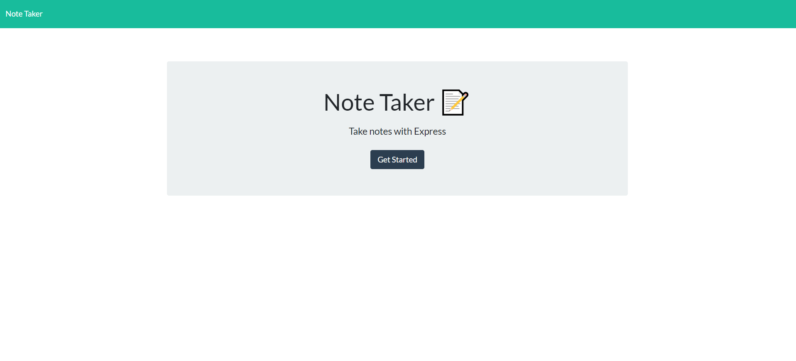
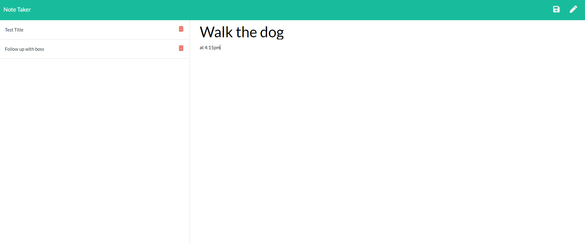

# note-taker

 

## Description

A Heroku deployed app that uses express to create a server. Write and save notes for yourself. Delete them if no longer needed. [Watch the video]() to see how to use, follow the steps, or go to [the deployed app](https://safe-escarpment-93726.herokuapp.com/).

## How To

- Go to [deployed app on Heroku](https://safe-escarpment-93726.herokuapp.com/)
- Otherwise, clone repository and follow steps below
- Install dependencies from package.json
- Enter node server.js in terminal to start server
- Open a browser and go to localhost:3000
- Click the "Get Started button to create your first note
- Click on "Note Title" to add your title
- Use tab or click on "Note Text" to add your note
- Save your note by clicking the save button
- Delete saved notes by clicking on the red trash can

### Usage Video

[video of how to use note-taker]()

### License

MIT License

### Screenshots

